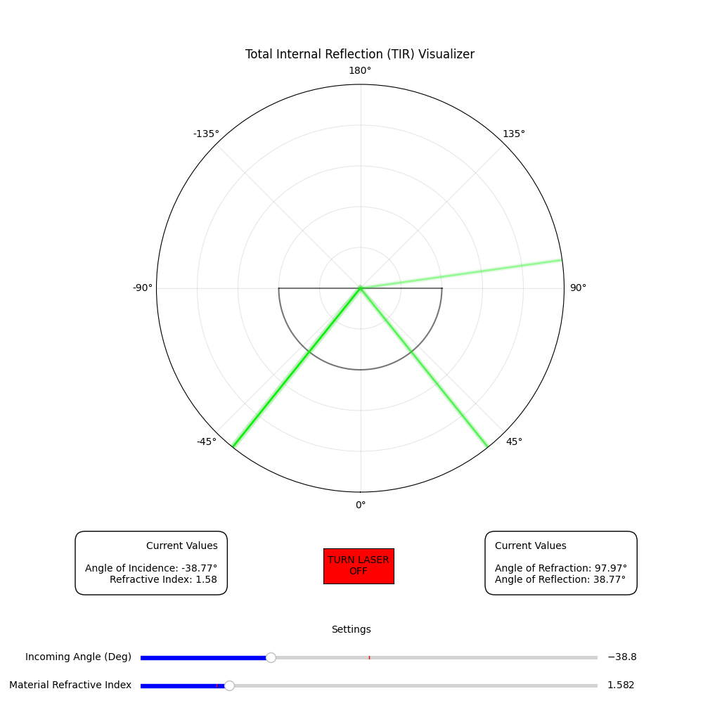
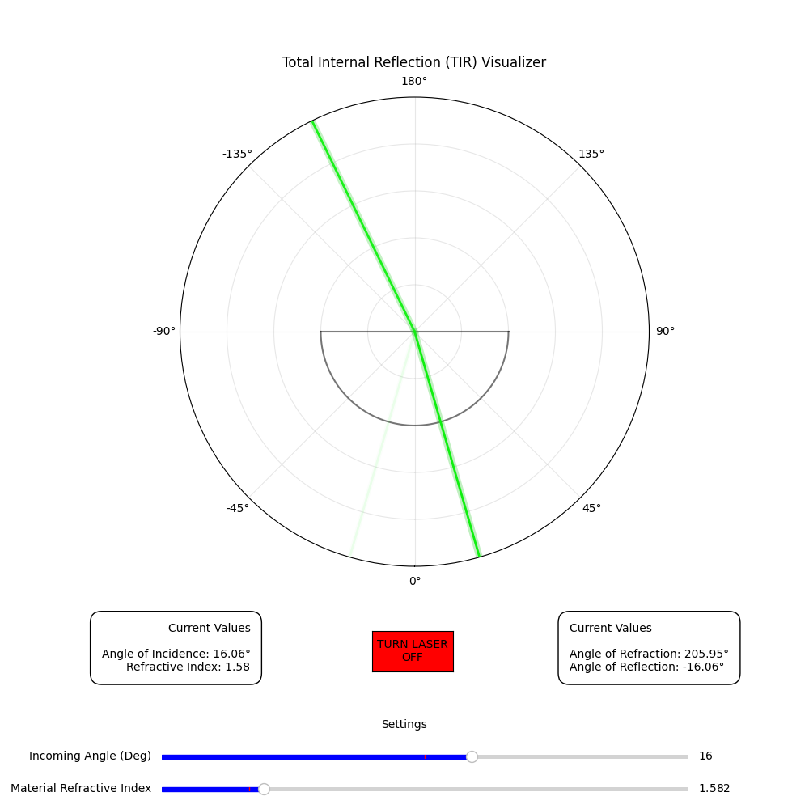
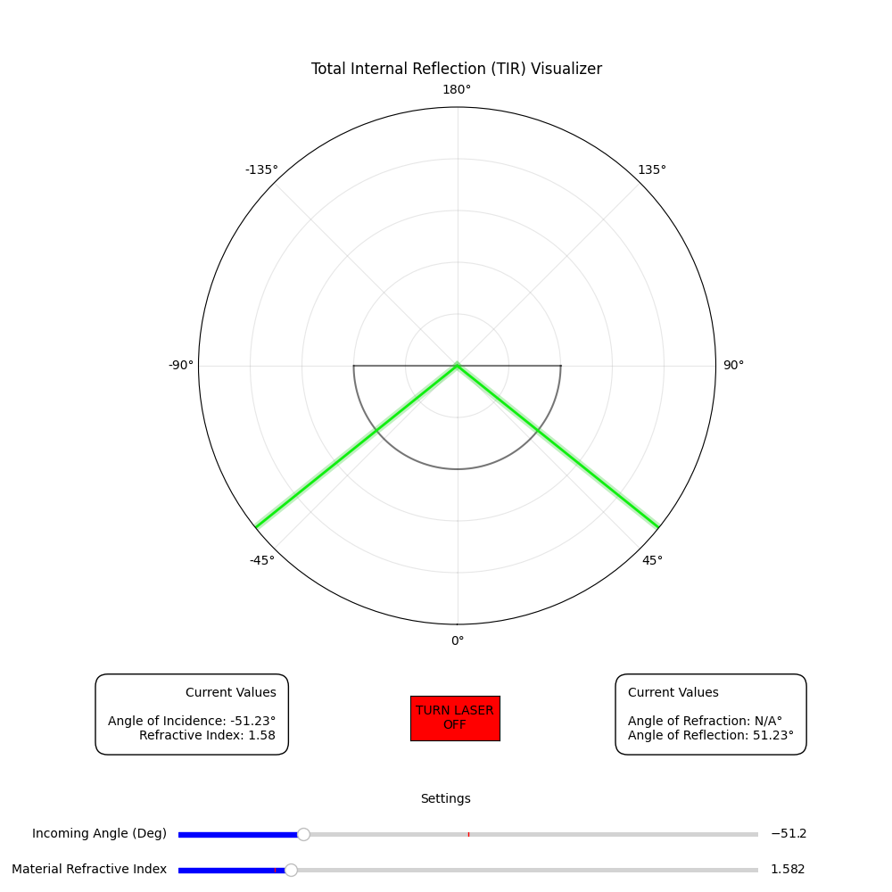

# Total Internal Reflection (TIR) Visualizer
### Author: Adill Al-Ashgar

## Introduction
Simple simulation of the phenomena of total internal reflection (TIR) usefull as a teaching resource. Inspired by QuantumBoffin and his simple and beautiful [Total Internal Reflection video](https://www.youtube.com/watch?v=NAaHPRsveJk).

This Python script visualizes the phenomenon of Total Internal Reflection (TIR) using Matplotlib. Total Internal Reflection occurs when light traveling in a medium with a higher refractive index encounters a boundary with a medium of lower refractive index at an angle of incidence greater than the critical angle. In this simulation, you can control the angle of incidence and the refractive index of the material.

## Table of Contents
- [Introduction](#introduction)
- [Program Controls](#program-controls)
- [How it Works](#how-it-works)

- [Roadmap](#roadmap)
- [Installation](#installation)
- [Usage](#usage)
- [Equations](#equations)
- [License](#license)
- [Contributions](#contributions)
- [Contact](#contact)

## Program Controls 

Once the simulation window appears, you can interact with the following components:

   - **TURN LASER ON/OFF Button**: Toggle the laser beam on and off.

   - **Material Refractive Index Slider**: Adjust the refractive index of the material to observe how it affects the behavior of light at the boundary.

   - **Incoming Angle (Deg) Slider**: Control the angle of incidence of the laser beam.

Observe the behavior of the laser beam as it interacts with the material boundary. You can see the reflection and refraction of the beam based on the angle of incidence and the refractive index.

The simulation also displays current values for the angle of incidence, angle of refraction (if applicable), and angle of reflection (if applicable).

## How it Works

This script simulates the TIR phenomenon by calculating the angles of reflection and refraction using Snell's Law. It visualizes the laser beam, its reflection, and refraction, and updates the display in real-time based on user input.

## 1. Introduction

Reflection and refraction are two fundamental processes that occur when light encounters the boundary between different media. Total internal reflection is a unique phenomenon associated with refraction under specific conditions. In this document, we delve into the principles governing these optical phenomena, exploring their significance in the field of optics, physics, and various technological applications.

## 2. Reflection
Reflection is the process by which light waves bounce off the surface of an object or material, following the law of reflection. According to this law, the angle of incidence (θᵢ) is equal to the angle of reflection (θᵣ), and both angles are measured with respect to the surface normal (Fig. 1).

Mathematically, this can be expressed as:

$$θᵢ = θᵣ$$

## 3. Refraction
Refraction is the bending of light as it passes from one medium into another with a different refractive index (Fig. 2). This bending occurs due to the change in the speed of light in different media, as described by Snell's Law:

$$n₁ \cdot \sin(θ₁) = n₂ \cdot \sin(θ₂)$$

Where:
- $n₁$ and $n₂$ are the refractive indices of the first and second media, respectively.
- $θ₁$ is the angle of incidence, and $θ₂$ is the angle of refraction.

## 4. Total Internal Reflection
Total internal reflection occurs when light travels from a medium with a higher refractive index to one with a lower refractive index at an angle of incidence greater than the critical angle (Fig. 3). Beyond this critical angle, no refraction occurs, and all the light is reflected back into the high-index medium.

The critical angle (\(θ_c\)) can be calculated using:

$$θ_c = \arcsin\left(\frac{n₂}{n₁}\right)$$

## License
This project is not currently licensed. 

## Contributions
Contributions to this codebase are welcome! If you encounter any issues, bugs or have suggestions for improvements please open an issue or a pull request on the [GitHub repository](https://github.com/Adillwma/DeepClean-Noise-Suppression-for-LHC-B-Torch-Detector).

## Contact
For any further inquiries or for assistance, please feel free to reach out to me at adill@neuralworkx.com.

